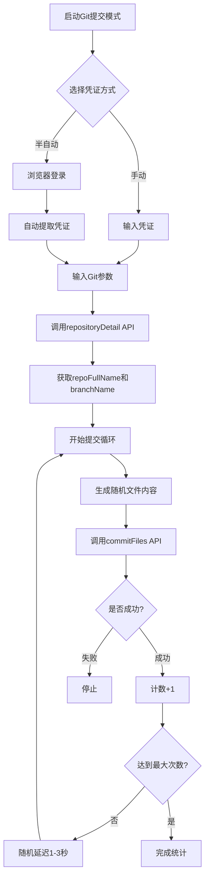

# Git 提交功能使用说明

## 功能概述

在 `websocket_simulator2.0.py` 中新增了 Git 提交模拟功能，支持以下特性：

- **智能参数获取**: 只需提供项目ID、仓库ID和文件路径，其他信息自动获取
- **自动仓库查询**: 通过 API 自动获取仓库全名和默认分支
- **随机内容生成**: 自动生成随机文件内容，确保每次提交都有变更
- **简短内容模板**: 使用简短的 Markdown 模板，减少提交内容大小
- **智能限制**: 默认8次提交，最大支持10次提交
- **双凭证模式**: 支持半自动登录和手动输入凭证

## 用户最少输入参数

### 必需参数（仅3个）
1. **项目ID** (projectId) - 例如: `25718`
2. **仓库ID** (repositoryId) - 例如: `342513`
3. **文件路径** (filePath) - 例如: `README.md`

### 自动获取参数
以下参数无需用户输入，由系统自动处理：

| 参数 | 获取方式 | 说明 |
|------|----------|------|
| sessionId | 登录凭证 | 从半自动登录或手动输入获取 |
| userId | 登录凭证 | 从半自动登录或手动输入获取 |
| repoFullName | API查询 | 通过 repositoryDetail API 自动获取 |
| branchName | API查询 | 通过 repositoryDetail API 自动获取（默认master） |
| operationType | 固定值 | 固定为 "4" (修改文件) |
| needReview | 固定值 | 固定为 0 (不需要评审) |
| fileType | 固定值 | 固定为 0 (普通文件) |
| fileContent | 自动生成 | 随机生成简短的 Markdown 内容 |
| fileCommitMessage | 自动生成 | 格式: "更新文件 {repo}/{file}" |

## 使用方式

### 方式 1: 半自动模式（推荐）

```bash
python3 websocket_simulator2.0.py
```

1. 选择 `5` (Git 提交模式)
2. 选择 `1` (半自动登录)
3. 在浏览器中登录
4. 等待凭证自动提取
5. 输入项目ID: `25718`
6. 输入仓库ID: `342513`
7. 输入文件路径: `README.md` (或直接回车使用默认值)
8. 输入提交次数: 直接回车使用默认值8，最大10
9. 确认并开始

### 方式 2: 手动输入凭证

```bash
python3 websocket_simulator2.0.py
```

1. 选择 `5` (Git 提交模式)
2. 选择 `2` (手动输入凭证)
3. 输入 Invoker ID 和 Session ID
4. 输入项目ID、仓库ID、文件路径
5. 输入提交次数
6. 确认并开始

## 工作流程



## API 调用说明

### 1. 获取仓库详情 API

**请求**:
```http
GET /api/codebackend/codecenter/repository/v1/repositoryDetail?repositoryId=342513
Headers:
  - projectid: 25718
  - sessionid: xxx
  - userid: 186812
```

**响应**:
```json
{
    "code": 0,
    "data": {
        "repoFullName": "XCDMX/web-srd",
        "defaultBranchName": "master",
        ...
    }
}
```

### 2. 提交文件 API

**请求**:
```http
POST /api/codebackend/codecenter/gitclient/v1/commitFiles
Headers:
  - projectid: 25718
  - sessionid: xxx
  - userid: 186812

Form Data:
  - operationType: "4"
  - repository: {"repoId":"342513","repoFullName":"XCDMX/web-srd"}
  - branch: {"branchName":"master","needReview":0}
  - files: [{"fileType":0,"filePath":"README.md","fileContent":"...","fileCommitMessage":"..."}]
```

**响应**:
```json
{
    "code": 0,
    "msg": "成功"
}
```

**错误响应**:
```json
{
    "code": 2928,
    "msg": "提交被忽略，请检查是否存在以下情况：1.未修改内容；2.当前文件与仓库版本完全一致或规则过滤；3.文件路径已被.gitignore文件规则排除。"
}
```

## 文件内容模板

脚本使用简短的 Markdown 模板生成文件内容，每次提交都会有变化：

```markdown
# {title}

更新时间: {timestamp}

<!-- commit-{count}-{unix_timestamp} -->
```

**特点**:
- 内容简短（约50-100字符）
- 包含时间戳确保每次不同
- 包含唯一标识符
- 使用 Markdown 格式

**示例输出**:
```markdown
# 项目文档

更新时间: 2025-11-04 18:30:45

<!-- commit-1-1762251845 -->
```

## 配置参数

| 参数 | 默认值 | 最大值 | 说明 |
|------|--------|--------|------|
| max_commits | 8 | 10 | 最大提交次数 |
| delay_min | 1.0秒 | - | 最小延迟时间 |
| delay_max | 3.0秒 | - | 最大延迟时间 |
| file_path | README.md | - | 默认文件路径 |

## 注意事项

1. **提交次数限制**: 默认8次，最大10次，超过会自动调整
2. **内容变更要求**: 每次提交的内容必须不同，否则会被忽略（错误码2928）
3. **文件必须存在**: 目标文件必须在仓库中已存在
4. **分支权限**: 确保账号对目标分支有提交权限
5. **延迟控制**: 提交之间有1-3秒随机延迟，避免请求过快
6. **SSL验证**: 已禁用SSL证书验证以避免证书问题

## 故障排除

### 问题 1: 获取仓库信息失败
**原因**: 凭证过期或项目ID/仓库ID错误
**解决方案**:
- 检查项目ID和仓库ID是否正确
- 重新登录获取新凭证

### 问题 2: 提交被忽略（错误码2928）
**原因**: 文件内容未变更
**解决方案**:
- 脚本会自动生成带时间戳的内容
- 如果仍然被忽略，可能是文件被.gitignore过滤

### 问题 3: HTTP请求失败
**原因**: 网络问题或服务端错误
**解决方案**:
- 检查网络连接
- 稍后重试

### 问题 4: 文件路径错误
**原因**: 文件不存在于仓库中
**解决方案**:
- 确保文件已在仓库中存在
- 使用正确的文件路径（相对于仓库根目录）

## 示例输出

```
[186812] 开始 Git 提交模拟...
   项目ID: 25718
   仓库ID: 342513
   文件路径: README.md
   目标提交次数: 8

[186812] 正在获取仓库信息...
[186812] ✅ 仓库信息获取成功
   仓库名称: XCDMX/web-srd
   默认分支: master
[186812] 正在提交文件 #1/8...
[186812] ✅ 提交成功 #1/8
[186812] 等待 2.3 秒...

[186812] 正在提交文件 #2/8...
[186812] ✅ 提交成功 #2/8
[186812] 等待 1.7 秒...

...

[186812] 完成！
   提交次数: 8/8
   耗时: 18.5秒
```

## 代码结构

### GitCommitSimulator 类

```python
class GitCommitSimulator:
    def __init__(self, invoker_id, session_id, project_id, repository_id, file_path, max_commits)
    def _get_random_content(self) -> str              # 生成随机文件内容
    def get_repository_detail(self) -> bool           # 获取仓库详情
    def commit_file(self) -> bool                     # 提交文件
    def run(self)                                     # 运行提交循环
```

### 主要方法说明

**`get_repository_detail()`**
- 调用 repositoryDetail API
- 自动获取 repoFullName 和 defaultBranchName
- 返回成功/失败状态

**`commit_file()`**
- 生成随机文件内容
- 构建提交请求
- 调用 commitFiles API
- 处理成功/失败/忽略三种情况

**`run()`**
- 主循环控制
- 统计提交次数
- 控制延迟时间

## 优势总结

✅ **最少输入**: 只需3个参数（项目ID、仓库ID、文件路径）
✅ **自动化**: 仓库信息、分支名称自动获取
✅ **智能内容**: 每次生成不同的简短内容
✅ **安全限制**: 最大10次提交，防止误操作
✅ **友好提示**: 详细的日志输出和错误提示
✅ **灵活凭证**: 支持半自动和手动两种方式
✅ **容错处理**: 自动处理提交被忽略的情况

## 与其他功能对比

| 功能 | 代码补全 | 代码注释 | Git提交 |
|------|----------|----------|---------|
| 默认次数 | 2000 | 10 | 8 |
| 最大次数 | 无限制 | 20 | 10 |
| 协议 | WebSocket | WebSocket | HTTP API |
| 需要参数 | 少 | 中 | 少 |
| 延迟时间 | 0.5-2.5s | 0.5-2.5s | 1-3s |

## 更新日志

### v2.1 新增
- ✅ 新增 Git 提交模拟功能
- ✅ 实现仓库信息自动查询
- ✅ 实现文件内容随机生成
- ✅ 集成到主菜单系统
- ✅ 支持双凭证模式（半自动/手动）
- ✅ 添加提交次数限制和保护
